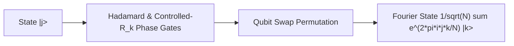

# Quantum Fourier Transform (QFT) Skill

High-efficiency, zero-dependency Python implementation of the **Quantum Fourier Transform (QFT)** for quantum phase estimation and Shor's period finding.

## Features
- **Discrete Fourier Phase Rotation**: Maps computational basis states \(|j
angle\) into frequency domain phase states.
- **Unitary Normalization**: Exact preservation of statevector inner product and Euclidean norm.
- **Zero External Dependencies**: Pure Python standard library (`cmath`, `math`).
- **Native MCP Protocol**: JSON-RPC 2.0 stdio server compatible with Claude Desktop, Cursor, and Windsurf.

## Architecture

